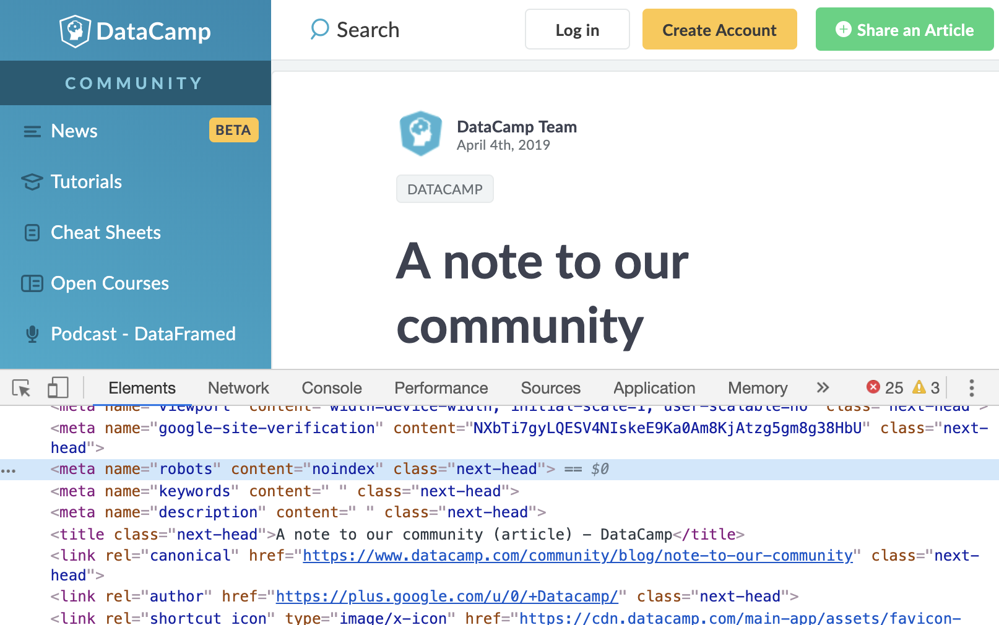

Last week (April 4, 2019) DataCamp [published a blog post](https://www.datacamp.com/community/blog/note-to-our-community) stating that "one of DataCamp's executives danced inappropriately and made uninvited physical contact with another employee," an action meeting many [definitions of sexual assault](https://www.rainn.org/articles/sexual-assault). While the post makes the claim that DataCamp does not condone this behavior, it also makes clear that the disciplinary actions against the executive were limited to "sensitivity training, personal coaching, and a strong warning."

DataCamp's post came one day after a group of 100 DataCamp instructors, including me, signed a letter to DataCamp leadership. Having learned of the incident, several instructors had been engaged with DataCamp to try to get the company to act in a way that appropriately disciplined the executive and assured a safe working environment for DataCamp employees and instructors. Inaction led those leaders to encourage more of us to get involved. DataCamp's responses to our questions and comments were largely along the lines of the letter. In short: He got a warning, we have great policies and diversity initiatives now, this matter is closed.

Many others have eloquently described how this response is grossly inadequate:

<blockquote class="twitter-tweet" data-conversation="none" data-lang="en">

this post is nauseating. it can barely bother to be contrite. missing from the list of actions the company has taken are:  - any consequences for the perpetrator/executive  - anything the company has done to make things right for the employee.<a href="https://twitter.com/hashtag/Python?src=hash&amp;ref_src=twsrc%5Etfw">#Python</a> <a href="https://twitter.com/hashtag/rstats?src=hash&amp;ref_src=twsrc%5Etfw">#rstats</a> <a href="https://twitter.com/hashtag/datascience?src=hash&amp;ref_src=twsrc%5Etfw">#datascience</a> <a href="https://twitter.com/hashtag/MeToo?src=hash&amp;ref_src=twsrc%5Etfw">#MeToo</a>

--- just moomin 🏳️
🌈🏴 (@no_reply) <a href="https://twitter.com/no_reply/status/1113923411237957632?ref_src=twsrc%5Etfw">April 4, 2019</a>
</blockquote>

<blockquote class="twitter-tweet" data-conversation="none" data-lang="en">
They could start by firing the guy who can&#39;t keep his hands to himself.
&mdash; Jesse Mostipak (@kierisi) <a href="https://twitter.com/kierisi/status/1113931192611610624?ref_src=twsrc%5Etfw">April 4, 2019</a></blockquote>

<blockquote class="twitter-tweet" data-conversation="none" data-lang="en">

And by writing a responsible incident report...all the extra detail is on the behalf of the perpetrator. I don't care if it was at a Bull Fight in Cuba at 4pm, or at 8am in the copy room. I don't care if it was reported 20 minutes later, or at the start of the next fiscal quarter. <a href="https://t.co/2XLtURDDfc">pic.twitter.com/2XLtURDDfc</a>

--- Mara Averick (@dataandme) <a href="https://twitter.com/dataandme/status/1113939480300355584?ref_src=twsrc%5Etfw">April 4, 2019</a>
</blockquote>

<blockquote class="twitter-tweet" data-partner="tweetdeck">

I've supported D.C. publicly, been on their podcast & pay for their service. I'm VERY displeased with how this was handled. This blog post is bullshit. The post spins a bunch of detail that casts shade / doubt on the victim.   This is wrong.   Do better, y'all. <a href="https://t.co/NpR9G6aKQG">https://t.co/NpR9G6aKQG</a>

--- JD Long (@CMastication) <a href="https://twitter.com/CMastication/status/1114131107182723072?ref_src=twsrc%5Etfw">April 5, 2019</a>
</blockquote>

_(Edit, 2019-04-16: [`@skeptycal`](https://twitter.com/skeptycal) ha a particularly sharp [analysis](https://medium.com/@miketreanor/datacamp-the-teacher-gave-you-an-f-cedb1b19bfd7) of just how this statement fails so completely.)_

I was, probably credulously, shocked at the statement DataCamp put out. After 100 instructors told them that they couldn't just leave it at that, they wrote a public statement to leave it at that. We got no message like "we are making a statement, and something more robust is coming." Nor did DataCamp give the target any warning that they would make the incident public by releasing a statement.

The last part was especially galling given how cautious the instructors who organized us were about avoiding blowback to other parties. The instructors who led the effort were patient, despite months of frustrating conversations with DataCamp. They kept the matter private to avoid dragging the target of the incident into the fray. They kept the focus on DataCamp leadership and policy to avoid putting other employees in an awkward place. They gave DataCamp every opportunity to explain themselves, change course, and own the public narrative. A company should count itself lucky to have such constructive critics.

It's clear that without enormous public pressure, DataCamp will not take sufficient disciplinary action against the executive. And it is necessary that they do. It must be made very clear to men, from teenage boys to CEOs, that when they choose to violate women's space, they are risking their jobs. When they decide to abuse their power as bosses, their careers, their VC funding, their tenure, their board seats, their reputation, and their friends, should all be on the line.

I guarantee you that women who are targets of such predation weigh the consequences of every subsequent action. Do they choose to leave their jobs? Do they report the incident and let it upend their career? Do they pursue criminal charges and let it consume their lives, with little chance of success? Do they stay quiet but carefully plan every day to avoid being alone in the room with their predator? Do they laugh it off and risk reprisal when this is interpreted as permission and they reject further advancement?

Let men who can't keep their hands to themselves live their lives questioning every decision.

The way to make men face consequences for their decisions is to force reprecussions via companies and institutions. So I hope you don't take my DataCamp course. I hope you will stop using DataCamp and let them know this is why. I hope if your company uses DataCamp you convince them to stop buying licenses. I hope if you invest in or advertise with or accept sponsorships from DataCamp you stop.

If enough pressure is brought on the company to make investors worry about their money and other executives about their jobs, we might see some meaningful action. Scolding DataCamp while continuing to pay them, because it's a nice platform, is like sensitivity training for a "nice guy."

My course on DataCamp is *Nonlinear Modeling in R with GAMs*. It's about Generalized Additive Models, tools I find quite handy and that I'd love to teach you more about. My contract with DataCamp gives them license to keep using it. Please don't take my course. Don't give DataCamp your money and send the message that sexual misconduct doesn't have consequences. I've collected some other resources on GAMs on [this page](https://github.com/noamross/gam-resources). I hope to convert my course to an open-source format soon, but for now these will more than do. Others are at least skilled as explaining the topic as I am.

### Yet More updates (2019-04-16)

         

Read Julia Silge's [thoughtful post](https://juliasilge.com/blog/datacamp-misconduct/) on how DataCamp lost her trust.

### More updates (2019-04-15)

The SatRdays organization has put out a [statement](https://satrdays.org/blog/2019/04/14/datacamp-sponsorship/) that they are dropping DataCamp sponsorship from their events.

Two former DataCamp employees, Dhavide Aruliah and Greg Wilson, were fired in mid-2018 after complaining to management about handling of sexual harassment.
Here are statements from [Dhavide](https://dhavide.github.io/a-note-to-our-commuity-on-building-trust.html) and [Greg](http://third-bit.com/2019/04/15/an-exchange-with-datacamp.html) (and some other relevant posts from Greg: [1](http://third-bit.com/2019/04/05/the-worst-behavior.html), [2](http://third-bit.com/2019/04/14/the-people-you-have.html)).  Both say that
DataCamp claimed their firings were due to poor performance.  I find that aburd, as their
stamp is all over DataCamp's products.  I tweeted a brief thread about this
[here](https://twitter.com/noamross/status/1117802588269891584).

RStudio announced they will stop working with DataCamp in [this tweet thread](https://twitter.com/rstudio/status/1117889763711696896)

### Some updates (2019-04-13)

People have asked whether instructors have the right to pull their content off of DataCamp:

<blockquote class="twitter-tweet tw-align-center" data-partner="tweetdeck">
In general, no. Contract terms vary a bit, but for me: I retain IP and the right to post it elsewhere, but grant DC a perpetual, non-exclusive license to the course material in return for royalties. I&#39;ve requested breaking the contract by mutual consent, have not heard back.
&mdash; Noam Ross (@noamross) <a href="https://twitter.com/noamross/status/1117050638955892742?ref_src=twsrc%5Etfw">April 13, 2019</a></blockquote>

There are statements from [R-Ladies](https://blog.rladies.org/post/statement-about-datacamp/) and [Women+ in Machine Learning & Data Science](https://twitter.com/wimlds/status/1115734798113300481) comdemning DataCamp. Lots of other instructors are  disassociating themselves from the DataCamp and putting their materials somewhere else for learners to use. I expect many more to come. All these people are giving up income. Support them, their organizations and
projects as you can.

<blockquote class="twitter-tweet" data-cards="hidden">
🗣 Please don&#39;t take my <a href="https://twitter.com/DataCamp?ref_src=twsrc%5Etfw">@DataCamp</a> course, as <a href="https://twitter.com/noamross?ref_src=twsrc%5Etfw">@noamross</a> put it in his post today, there must be consequences for sexual assault. <a href="https://t.co/3G1TkfZpK1">https://t.co/3G1TkfZpK1</a>  Here is a shinydashboard course you can take instead:<a href="https://t.co/SNUfY6zdnD">https://t.co/SNUfY6zdnD</a>
&mdash; 𝓛𝓾𝓬𝔂::postdoc🌻 (@LucyStats) <a href="https://twitter.com/LucyStats/status/1116820229026451457?ref_src=twsrc%5Etfw">April 12, 2019</a></blockquote>

<blockquote class="twitter-tweet" data-lang="en">
Greg was one of the reasons I developed my course with DataCamp. After he was fired for &quot;performance&quot;, they tried to bribe him with a month&#39;s pay if he signed a non-disparagement agreement. This company is rotten to the core. <a href="https://t.co/qULEffAZ3Y">https://t.co/qULEffAZ3Y</a>
&mdash; Dr. Alex Hanna (@alexhanna) <a href="https://twitter.com/alexhanna/status/1117873795060998144?ref_src=twsrc%5Etfw">April 15, 2019</a></blockquote>

<blockquote class="twitter-tweet" data-conversation="none" data-lang="en">
FWIW I don&#39;t feel in an awkward position. By which I mean it&#39;s easy for  me to state: I would encourage everyone NOT to take or pay for my Bokeh course on DC (or any others). Very sorry this happened to you and very disappointed in DC leadership.
&mdash; 🔴 (@bigreddot) <a href="https://twitter.com/bigreddot/status/1116725574070706176?ref_src=twsrc%5Etfw">April 12, 2019</a></blockquote>

<blockquote class="twitter-tweet" data-cards="hidden" data-lang="en">
I&#39;m with Noam here, very well said! <a href="https://twitter.com/DataCamp?ref_src=twsrc%5Etfw">@DataCamp</a> need to be held accountable - do not take my course, I will be working on getting the content available in another medium soon, hopefully by mid year. <a href="https://t.co/02haKPYJE4">https://t.co/02haKPYJE4</a>
&mdash; Nicholas Tierney (@nj_tierney) <a href="https://twitter.com/nj_tierney/status/1116890872656711680?ref_src=twsrc%5Etfw">April 13, 2019</a></blockquote>

<blockquote class="twitter-tweet" data-lang="en">
tl;dr: please don’t take my course on <a href="https://twitter.com/DataCamp?ref_src=twsrc%5Etfw">@DataCamp</a>.
&mdash; Romain François 🧩 (@romain_francois) <a href="https://twitter.com/romain_francois/status/1117358197814321152?ref_src=twsrc%5Etfw">April 14, 2019</a></blockquote>

<blockquote class="twitter-tweet" data-lang="en">
I can not in good faith encourage anyone to take my <a href="https://twitter.com/hashtag/rstats?src=hash&amp;ref_src=twsrc%5Etfw">#rstats</a> and <a href="https://twitter.com/hashtag/python?src=hash&amp;ref_src=twsrc%5Etfw">#python</a> <a href="https://twitter.com/hashtag/dataviz?src=hash&amp;ref_src=twsrc%5Etfw">#dataviz</a> DataCamp courses given their recent horrific handling of the (not at all recent) sexual assault of a team member. See <a href="https://t.co/67Y8vkIcTg">https://t.co/67Y8vkIcTg</a> and <a href="https://t.co/VSpohatmfG">https://t.co/VSpohatmfG</a> and many more.
&mdash; Nick Strayer (@NicholasStrayer) <a href="https://twitter.com/NicholasStrayer/status/1117825231094206469?ref_src=twsrc%5Etfw">April 15, 2019</a></blockquote>

<blockquote class="twitter-tweet" data-lang="en">
I stopped developing my <a href="https://twitter.com/DataCamp?ref_src=twsrc%5Etfw">@DataCamp</a> course on data cleaning in <a href="https://twitter.com/hashtag/sql?src=hash&amp;ref_src=twsrc%5Etfw">#sql</a> <a href="https://twitter.com/hashtag/postgresql?src=hash&amp;ref_src=twsrc%5Etfw">#postgresql</a>. Requested contract termination ASAP. Course will be available on another platform. My gratitude to all that brought the situation to light. Post by <a href="https://twitter.com/noamross?ref_src=twsrc%5Etfw">@noamross</a>  speaks volumes: <a href="https://t.co/VX1ayxLmhH">https://t.co/VX1ayxLmhH</a>
&mdash; Casey Bates (@_casey_bates) <a href="https://twitter.com/_casey_bates/status/1118326453718773760?ref_src=twsrc%5Etfw">April 17, 2019</a></blockquote>

<blockquote class="twitter-tweet" data-cards="hidden" data-lang="en">
Until real change happens, please do not take my <a href="https://twitter.com/DataCamp?ref_src=twsrc%5Etfw">@DataCamp</a> course.  <a href="https://twitter.com/noamross?ref_src=twsrc%5Etfw">@noamross</a> said this better than I could: <a href="https://t.co/pmJkGDucGV">https://t.co/pmJkGDucGV</a>
&mdash; James Lamb (@_jameslamb) <a href="https://twitter.com/_jameslamb/status/1117245327340376065?ref_src=twsrc%5Etfw">April 14, 2019</a></blockquote>

<blockquote class="twitter-tweet" data-lang tw-align-center="en">
Like many others, I am encouraging people to not take my <a href="https://twitter.com/hashtag/DataCamp?src=hash&amp;ref_src=twsrc%5Etfw">#DataCamp</a> course, due to their unacceptable handling of sexual assault. There are many other places to learn about Bayesian regression modeling. Here are a few using the same packages as my course:
&mdash; Jake Thompson (@wjakethompson) <a href="https://twitter.com/wjakethompson/status/1117446422704611328?ref_src=twsrc%5Etfw">April 14, 2019</a></blockquote>

<blockquote class="twitter-tweet" data-lang tw-align-center="en">
I *can* say it&#39;s unlikely I&#39;ll ever use or recommend <a href="https://twitter.com/DataCamp?ref_src=twsrc%5Etfw">@DataCamp</a> again. They have, through their own arrogance, selfishness, &amp; shortsightedness irrevocably lost  the trust &amp; respect of the very community they rely on to build  content. (2/2)<a href="https://twitter.com/hashtag/MeTooSTEM?src=hash&amp;ref_src=twsrc%5Etfw">#MeTooSTEM</a>
&mdash; Dhavide Aruliah (@dhavidearuliah) <a href="https://twitter.com/dhavidearuliah/status/1117823182642323456?ref_src=twsrc%5Etfw">April 15, 2019</a></blockquote>

<blockquote class="twitter-tweet" data-lang="en">
1. Some of you may know of my course on R programming at <a href="https://twitter.com/DataCamp?ref_src=twsrc%5Etfw">@DataCamp</a>. Sadly, the company has failed to properly handle credible allegations of sexual assault perpetrated by a C-lvl exec. Please don’t take my course until they issue a proper remedy. <a href="https://twitter.com/hashtag/TimesUp?src=hash&amp;ref_src=twsrc%5Etfw">#TimesUp</a>.
&mdash; G. Elliott Morris (@gelliottmorris) <a href="https://twitter.com/gelliottmorris/status/1117943872234061825?ref_src=twsrc%5Etfw">April 16, 2019</a></blockquote>

<blockquote class="twitter-tweet" data-lang="en">
I was so proud &amp; excited to be mere *days* away from my 1st <a href="https://twitter.com/hashtag/DataCamp?src=hash&amp;ref_src=twsrc%5Etfw">#DataCamp</a> course being hard-launched! After learning about the organization&#39;s actions 🤬I have asked for my course to be withdrawn &amp; my contract terminated. I&#39;m waiting for a response &amp; very unsure of the legalities.
&mdash; Danielle Quinn (@daniellequinn88) <a href="https://twitter.com/daniellequinn88/status/1117860833499832321?ref_src=twsrc%5Etfw">April 15, 2019</a></blockquote>

<blockquote class="twitter-tweet" data-lang="en">
&quot;What I do need to maintain a continuing relationship with a company and/or people is trustworthiness and accountability.&quot;  <a href="https://twitter.com/juliasilge?ref_src=twsrc%5Etfw">@juliasilge</a> explains it perfectly.  You&#39;ve lost my trust <a href="https://twitter.com/DataCamp?ref_src=twsrc%5Etfw">@DataCamp</a> <a href="https://t.co/inMQJfHGlK">https://t.co/inMQJfHGlK</a>
&mdash; Charlotte Wickham (@CVWickham) <a href="https://twitter.com/CVWickham/status/1118306188800610304?ref_src=twsrc%5Etfw">April 17, 2019</a></blockquote>

<blockquote class="twitter-tweet" data-cards="hidden">
I applaud <a href="https://twitter.com/noamross?ref_src=twsrc%5Etfw">@noamross</a>&#39;s stance and I stand in full support of his position.  Please do not pay for or take my <a href="https://twitter.com/DataCamp?ref_src=twsrc%5Etfw">@DataCamp</a> course.  I&#39;ll be releasing an open book this summer that includes equivalent content and more for those of you who are using those resources. <a href="https://t.co/uo4O7CmqBG">https://t.co/uo4O7CmqBG</a>
&mdash; Kyle Walker (@kyle_e_walker) <a href="https://twitter.com/kyle_e_walker/status/1116711889382277121?ref_src=twsrc%5Etfw">April 12, 2019</a></blockquote>
<blockquote class="twitter-tweet" data-lang="en" data-cards="hidden">
It&#39;s incredibly disappointing how DataCamp has dealt with this situation. I will not be developing any more courses with them. <a href="https://t.co/G9lvBuRHwX">https://t.co/G9lvBuRHwX</a>
&mdash; Sarah Guido (@sarah_guido) <a href="https://twitter.com/sarah_guido/status/1114172339988639744?ref_src=twsrc%5Etfw">April 5, 2019</a></blockquote>

<blockquote class="twitter-tweet" data-lang="en">
I have two courses under development at <a href="https://twitter.com/DataCamp?ref_src=twsrc%5Etfw">@DataCamp</a>. I have ceased development on both and will not complete them. Outrageous. <a href="https://t.co/9vtBUSzp4A">https://t.co/9vtBUSzp4A</a>
&mdash; Chris Fonnesbeck (@fonnesbeck) <a href="https://twitter.com/fonnesbeck/status/1117813252963094528?ref_src=twsrc%5Etfw">April 15, 2019</a></blockquote>

Finally, when I was originally writing this post, I discovered that DataCamp's
blog post describing the event contained a piece of code, `<meta name="robots" content="noindex" class="next-head">`
which effectively makes the page invisible to search engines. [`@no_reply`](https://twitter.com/no_reply/status/1116843436001218561) and [Bob Rudis](https://rud.is/b/2019/04/12/a-note-to-our-community-on-how-to-hide-your-content-from-search-engines/)
both give more elaborate explanations. DataCamp doesn't do this for any of their other blog
posts.

<blockquote class="twitter-tweet tw-align-center" data-lang="en">
If you think <a href="https://twitter.com/DataCamp?ref_src=twsrc%5Etfw">@DataCamp</a> deserves credit for a public post that they did not discipline an executive for sexual misconduct, consider that they put this code in the HTML, so no search engines would index it. I don&#39;t see it anywhere else on their blog. <a href="https://twitter.com/hashtag/rstats?src=hash&amp;ref_src=twsrc%5Etfw">#rstats</a> <a href="https://twitter.com/hashtag/python?src=hash&amp;ref_src=twsrc%5Etfw">#python</a> <a href="https://twitter.com/hashtag/datasci?src=hash&amp;ref_src=twsrc%5Etfw">#datasci</a> <a href="https://twitter.com/hashtag/metoo?src=hash&amp;ref_src=twsrc%5Etfw">#metoo</a> <a href="https://t.co/xbQoSaQl5J">pic.twitter.com/xbQoSaQl5J</a>

&mdash; Noam Ross (@noamross) <a href="https://twitter.com/noamross/status/1116709899159916544?ref_src=twsrc%5Etfw">April 12, 2019</a></blockquote>

_(Edit 2019-04-17: On April 17th the `noindex` tag was removed.  Here is the page archived
[on the 16th](https://web.archive.org/web/20190416035941/http://www.datacamp.com/community/blog/note-to-our-community) and 
[on the 17th](https://web.archive.org/web/20190417114653/https://www.datacamp.com/community/blog/note-to-our-community))_

-------.-----------------------------------------------------------------

*This post represents my personal point of view and not that of my employer or any group I am affiliated with.*

